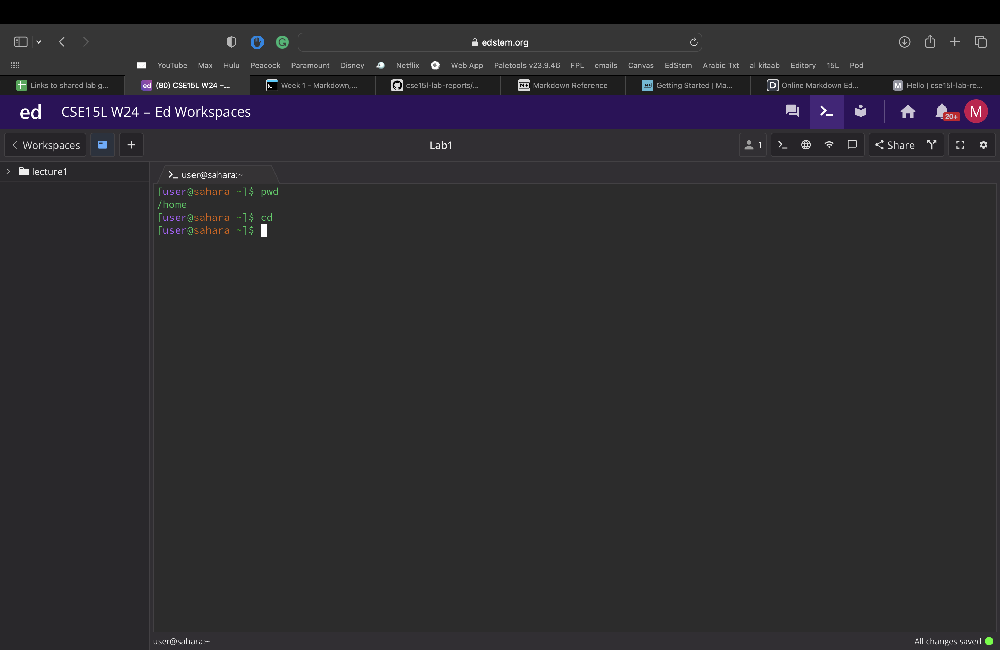
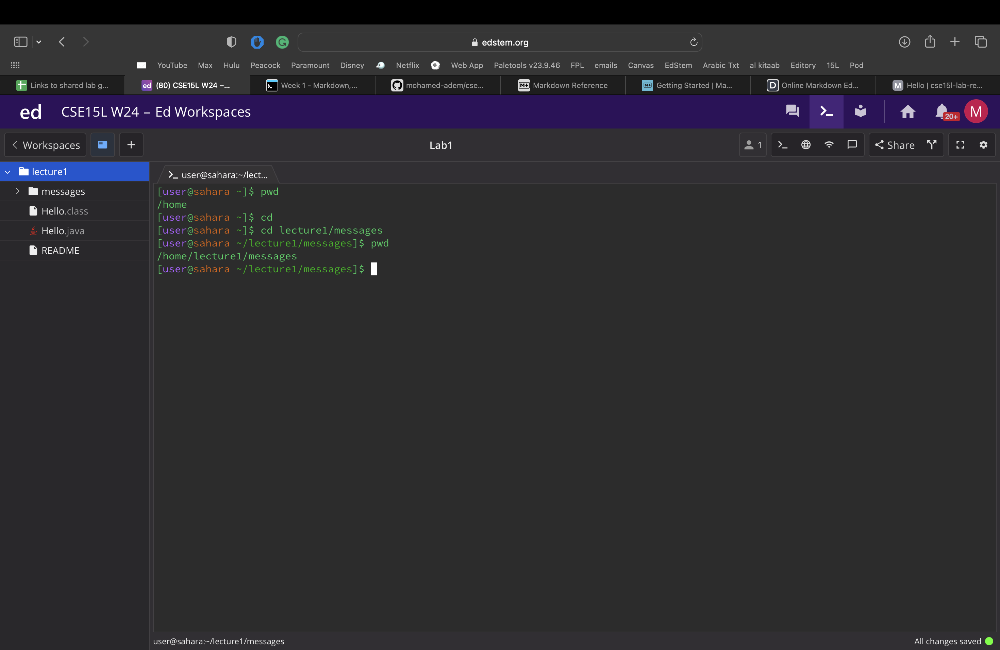
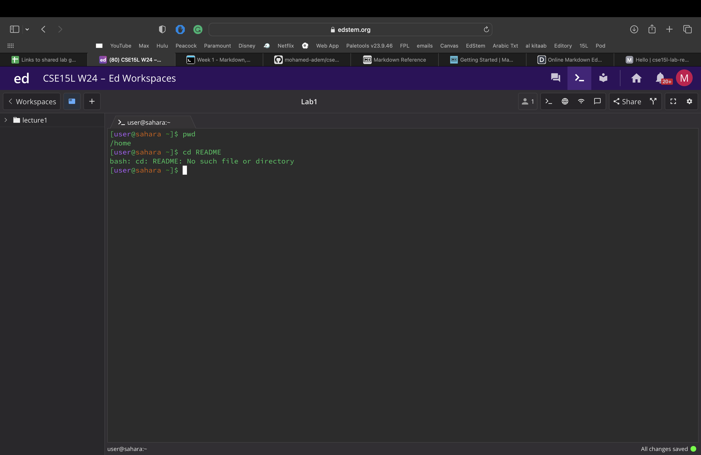
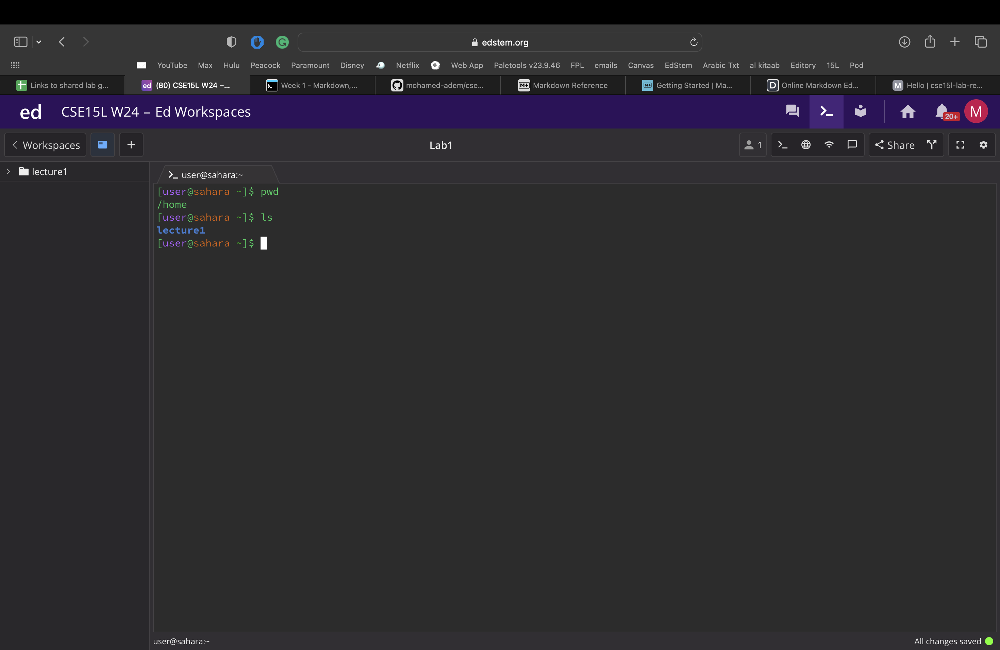
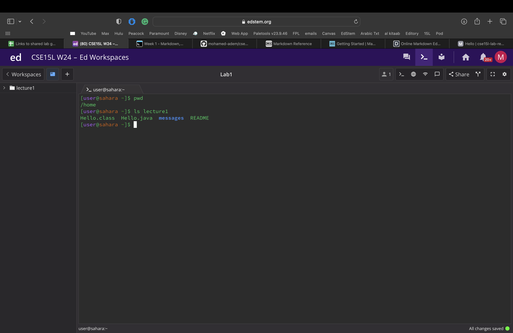
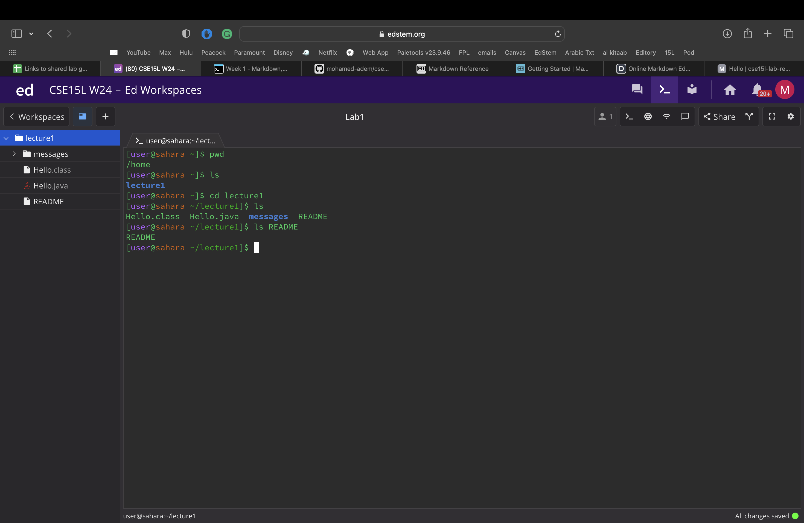
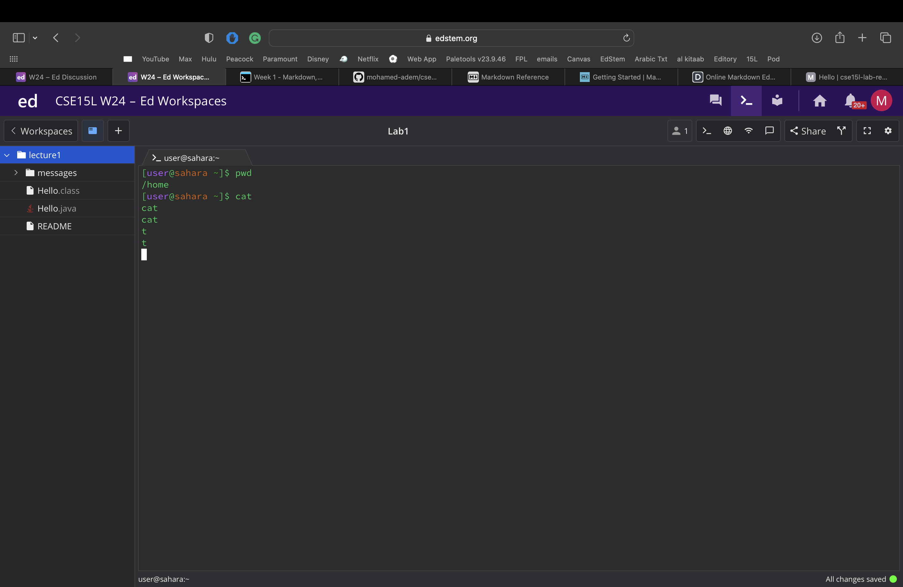
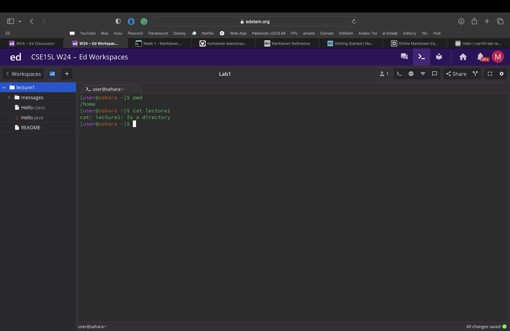
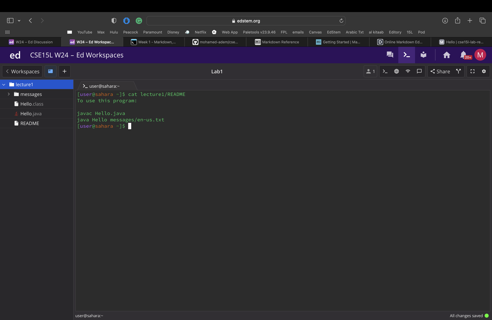

# cd
  # with no args
     - screenshot of code being run
         
     - The working directory was /home
     - I asked to change the directory without providing any args, so there was no output
     - No error
  # with a path to a directory as an arg
     - screenshot of code being run
         
     - The working directory was /home
     - I asked to change the directory to leture1/messages and thats what happened
     - No error

  # with a path to a file as an argument
     - screenshot of code being run
         
     - The working directory was /home
     - I got the output because a i put in a file as an arg
     - The output is an error, files are not directories so i would have needed to use a directory as an arg

# ls
  # with no args
     - screenshot of code being run
         
     - /home
     - lecture1 was the only folder/file in the home directory
     - No error

  # with a path to a directory as an arg
     - screenshot of code being run
         
     - /home
     - I asked what files were in the lecture1 directory
     - No error

  # with a path to a file as an argument
     - screenshot of code being run
          
     - /home/lecture1
     - I asked what files were in README
     - No error

# cat
  # with no args
     - screenshot of code being run         
           
     - /home
     - There was no args so no output
     - Cat can't be run without args if I want an output I would need to input an arg

  # with a path to a directory as an arg
     - screenshot of code being run
            
     - /home
     - cat can't be used with directories
     - Error as cat can only be used on files

  # with a path to a file as an argument
     - screenshot of code being run
            
     - home
     - I asked for the README file to be printed
     - No error
