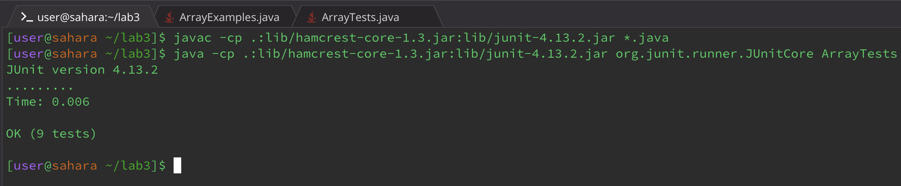
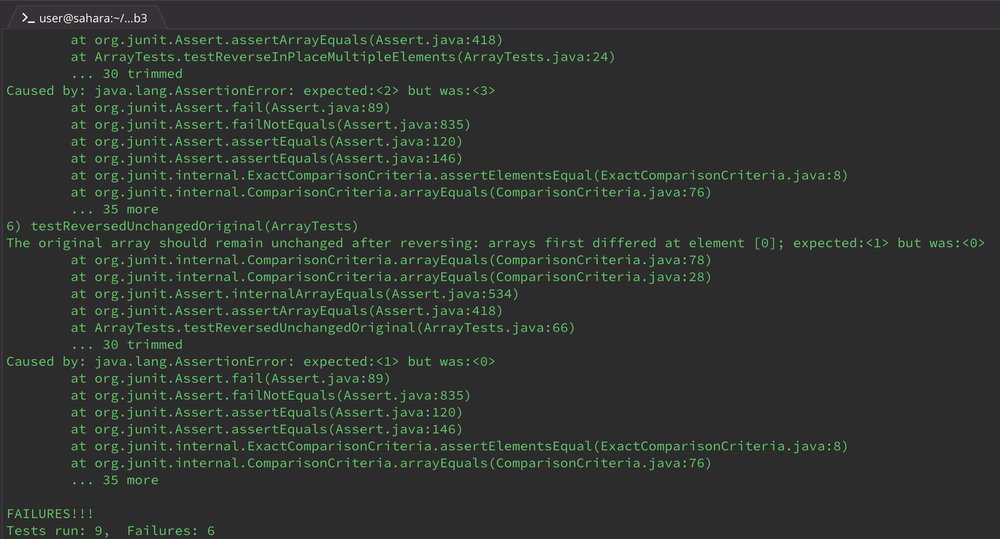

# Part 1: Bugs
  ## Failure Inducing Input
```java
@Test
public void testReversedFailure() {
    int[] input = {1, 2, 3, 4};
    int[] expected = {4, 3, 2, 1};
    int[] result = ArrayExamples.reversed(input);
    assertArrayEquals("The reversed array does not match the expected output", expected, result);
}
```

 

  ## Non-Failure Inducing Input
```java
@Test
public void testReversedNoFailure() {
    int[] input = {};
    int[] expected = {};
    int[] result = ArrayExamples.reversed(input);
    assertArrayEquals("The reversed array of an empty input should also be empty", expected, result);
}
```


  ## Symptom
    
    

  ## The Bug
    
### Before the Code Change:


```java
static int[] reversed(int[] arr) {
    int[] newArray = new int[arr.length];
    for(int i = 0; i < arr.length; i += 1) {
        arr[i] = newArray[arr.length - i - 1];
    }
    return arr;
}
```


  ### After the Code Change:


```java
static int[] reversed(int[] arr) {
    int[] newArray = new int[arr.length];
    for(int i = 0; i < arr.length; i++) {
        newArray[i] = arr[arr.length - i - 1];
    }
    return newArray;
}
```


# Part 2: Researching Commands
  ## Find Command
   ### Example 1
  ```
find ./technical -type d
```

./technical  
./technical/government  
./technical/government/About_LSC  
./technical/government/Env_Prot_Agen  
./technical/government/Alcohol_Problems  
./technical/government/Gen_Account_Office  
./technical/government/Post_Rate_Comm  
./technical/government/Media  
./technical/plos  
./technical/biomed  
./technical/911report  

   ### Example 2
   ```
find ./technical -type f -name "*.txt"
```
./technical/911report/chapter-9.txt   
./technical/911report/chapter-8.txt  
./technical/911report/preface.txt  
./technical/911report/chapter-12.txt  
./technical/911report/chapter-10.txt  
./technical/911report/chapter-11.txt  
(This is just a small part of the output, the entire terminal was filled"
  
  ## Name Command  
   ### Example 1
   ```
find ./technical -name "chapter-1.txt"
```
./technical/911report/chapter-1.txt

   ### Example 2
   ```
find ./technical/911report -name "*.txt"
```
./technical/911report/chapter-13.4.txt    
./technical/911report/chapter-13.5.txt   
./technical/911report/chapter-13.1.txt      
./technical/911report/chapter-13.2.txt    
./technical/911report/chapter-13.3.txt    
./technical/911report/chapter-3.txt    
./technical/911report/chapter-2.txt      
./technical/911report/chapter-1.txt    
./technical/911report/chapter-5.txt    
./technical/911report/chapter-6.txt   
./technical/911report/chapter-7.txt    
./technical/911report/chapter-9.txt    
./technical/911report/chapter-8.txt    
./technical/911report/preface.txt    
./technical/911report/chapter-12.txt    
./technical/911report/chapter-10.txt    
./technical/911report/chapter-11.txt    
  
  ## Size Command  
   ### Example 1
```
find ./technical -type f -size +100k
```
./technical/government/About_LSC/commission_report.txt  
./technical/government/About_LSC/State_Planning_Report.txt  
./technical/government/Env_Prot_Agen/multi102902.txt  
./technical/government/Env_Prot_Agen/ctm4-10.txt  
./technical/government/Env_Prot_Agen/bill.txt  
./technical/government/Env_Prot_Agen/tech_adden.txt  
./technical/government/Gen_Account_Office/d0269g.txt  
./technical/government/Gen_Account_Office/GovernmentAuditingStandards_yb2002ed.txt  
./technical/government/Gen_Account_Office/Sept27-2002_d02966.txt  
./technical/government/Gen_Account_Office/d01376g.txt  
./technical/government/Gen_Account_Office/Statements_Feb28-1997_volume.txt  
./technical/government/Gen_Account_Office/pe1019.txt  
./technical/government/Gen_Account_Office/gg96118.txt  
./technical/government/Gen_Account_Office/d01591sp.txt  
./technical/government/Gen_Account_Office/im814.txt  
./technical/government/Gen_Account_Office/ai9868.txt  
./technical/government/Gen_Account_Office/May1998_ai98068.txt  
./technical/government/Gen_Account_Office/d02701.txt  
./technical/biomed/1471-2105-3-2.txt  
./technical/911report/chapter-13.4.txt  
./technical/911report/chapter-13.5.txt  
./technical/911report/chapter-13.2.txt  
./technical/911report/chapter-13.3.txt  
./technical/911report/chapter-3.txt  
./technical/911report/chapter-1.txt  
./technical/911report/chapter-6.txt  
./technical/911report/chapter-7.txt  
./technical/911report/chapter-9.txt  
./technical/911report/chapter-12.txt  
   ### Example 2
```
find ./technical/biomed -type f -size -10k
```
./technical/biomed/1472-6769-1-4.txt  
./technical/biomed/1471-2490-3-2.txt  
./technical/biomed/1471-2334-3-13.txt  
  ## Max Depth Command  
   ### Example 1
   ```
find ./technical -maxdepth 1
```
./technical  
./technical/government  
./technical/plos  
./technical/biomed  
./technical/911report  

   ### Example 2
   ```
find ./technical -maxdepth 2
```
./technical
./technical/government
./technical/plos
./technical/biomed
./technical/911report
