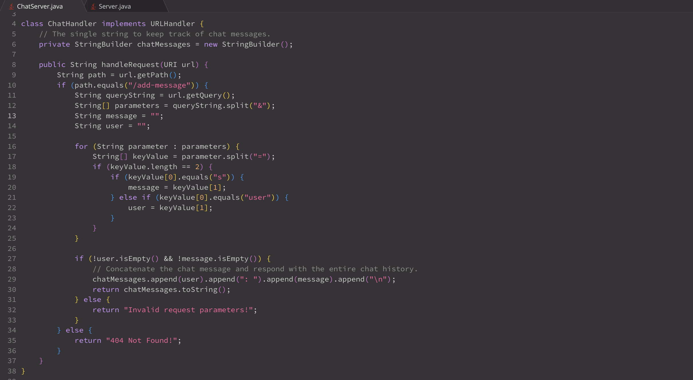
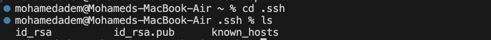
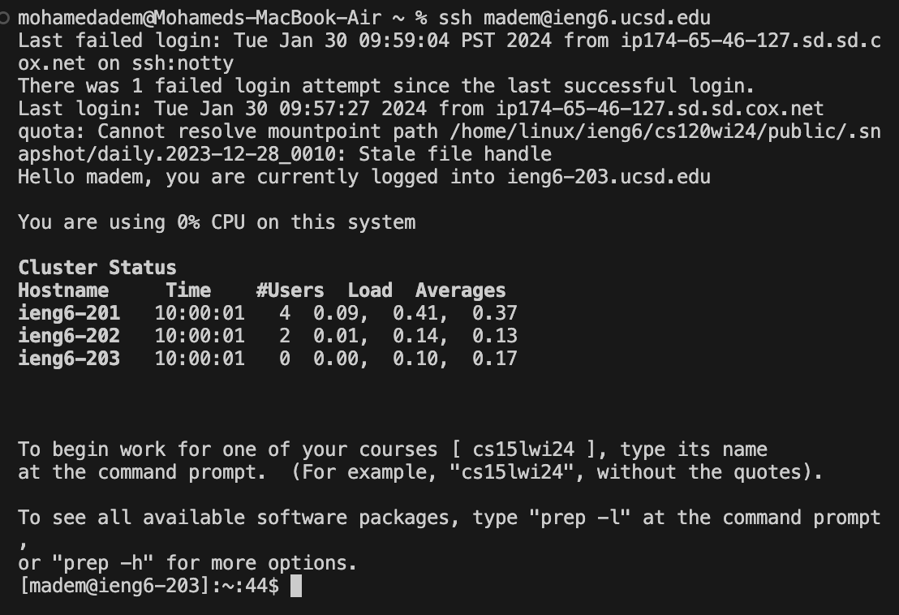

# Part 1
  
  Which methods in your code are called? The handleRequest method
What are the relevant arguments to those methods, and the values of any relevant fields of the class? URI url is the argument, and chatMessages is a field that stores the chat history
How do the values of any relevant fields of the class change from this specific request? If no values got changed, explain why. chatMessages gets updated based off the request

  
Which methods in your code are called? The handleRequest method 
What are the relevant arguments to those methods, and the values of any relevant fields of the class? URI url and chatMessages
How do the values of any relevant fields of the class change from this specific request? If no values got changed, explain why. chatMessages gets updated 

# Part 2
  
  

# Part 3 
I learned how to connect to a computer remotely. 
